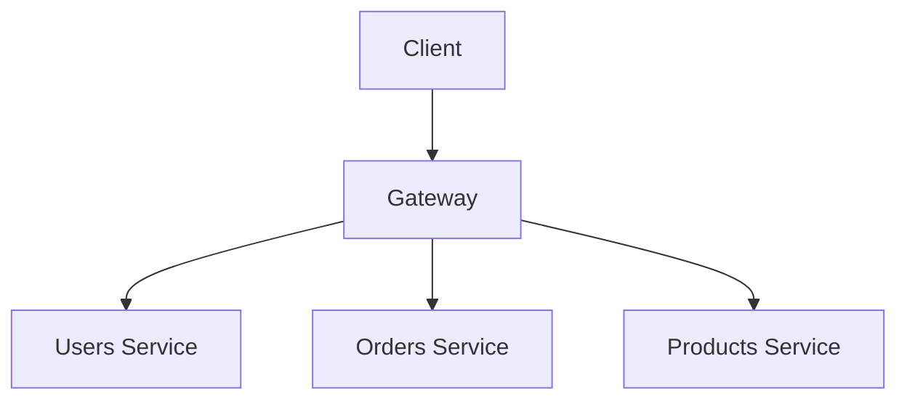

import { Tabs } from 'nextra/components'

# GraphQLフェデレーション

古典的なモノリスの代替設計アプローチは、しばしばマイクロサービスとして説明され、複雑なシステムをより小さな、独立して管理されるコンポーネントに分解することを強調します。ある意味で、GraphQLフェデレーションは、GraphQLのマイクロサービスのようなものです—GraphQLエコシステムで特に共鳴を見出したアーキテクチャパターンです。

GraphQLフェデレーションは、[Apollo GraphQLが2019年にApollo Federationを導入した](https://www.apollographql.com/blog/apollo-federation-f260cf525d21)後に広く採用されました。彼らの実装は、GraphQLコミュニティの参照ポイントとなり、GraphQLエコシステムで分散グラフを構築するための標準的なアーキテクチャパターンとしてフェデレーションを確立するのに役立ちました。

より多くの企業や開発者がフェデレーションを使用して分散GraphQLスキーマを構築する利点を見るにつれて、GraphQLエコシステムは現在、フェデレーションパターンの標準化に向かっています。GraphQL Foundationの[Composite Schema Working Group](https://github.com/graphql/composite-schemas-wg)は、[Apollo GraphQL](https://apollographql.com)、[ChilliCream](https://chillicream.com/)、[Graphile](https://www.graphile.org/)、[Hasura](https://hasura.io/)、[Netflix](https://www.netflix.com/)、[The Guild](https://the-guild.dev)など、業界全体のさまざまな組織のエンジニアを含み、[GraphQLフェデレーションの公式仕様](https://github.com/graphql/composite-schemas-spec)の作成に積極的に取り組んでいます。この取り組みは、GraphQLサービスが分散システム間でどのように構成され、実行されるかを標準化することを目的としており、革新と異なる実装の余地を確保しています。

## フェデレーションとは何ですか？

アーキテクチャ的には、フェデレーションは分散システムを組織化および管理するアプローチです。その核心では、フェデレーションは、自律的なコンポーネントが独立性を維持しながら協力することを可能にします。連邦政府システムのように考えてください：個々の州は主権を維持しながら、共有の懸念事項について中央権限の下で協力します。

ソフトウェアアーキテクチャでは、フェデレーションにより、組織は以下を可能にします：

- 独立したチーム間で責任を分散する
- 異なるコンポーネントを独立してスケールする
- 異なるドメイン間の明確な境界を維持する
- 自律的な開発とデプロイを可能にする
- 単一障害点を減らす

Webサイトで見る「Googleでログイン」または「Facebookでログイン」ボタンを考えてください。これはフェデレーションの実例です：各企業が独自のログインシステムを個別に管理しているにもかかわらず、GoogleまたはFacebookアカウントを使用して多くの異なるWebサイトにログインできます。

## フェデレーションGraphQLとは何ですか？

GraphQLフェデレーションは、これらの原則をGraphQL APIに適用します。組織が複数の独立したサービス（最も一般的にはサブグラフと呼ばれる）から統一されたGraphQLスキーマを構築できるようにし、それぞれがアプリケーションのデータグラフの一部を担当します。

eコマースプラットフォームを考えてみましょう：製品、ユーザーアカウント、注文処理を管理する別々のチームがあるかもしれません。GraphQLフェデレーションを使用すると、各チームは以下を実行できます：

- 独自のGraphQLスキーマを定義する
- サービスを独立してデプロイおよびスケールする
- 密結合なしで統一されたGraphQL APIに貢献する
- ドメイン固有のロジックの所有権を維持する

魔法は、中央コーディネーターとして機能するフェデレーションゲートウェイを通じて起こり、これらの別々のスキーマを、クライアントがクエリできる統一されたスキーマに構成します。

## GraphQLでのフェデレーションの仕組み

フェデレーションプロセスには、いくつかの主要なコンポーネントが含まれます：

- **サブグラフ**: 独自のGraphQLスキーマとリゾルバを定義する個別のサービス
- **ゲートウェイ**: クライアントとフェデレーションサービス間にある専門サービス
- **スキーマ構成**: それらの間の参照を解決しながらスキーマをマージするプロセス。多くの場合、スキーマレジストリによって処理されます。

<Tabs items={['Products subgraph', 'Orders subgraph', 'Users subgraph']}> <Tabs.Tab>

```graphql
type Product @key(fields: "id") {
  id: ID!
  title: String!
  price: Float!
  inStock: Boolean!
}
```

</Tabs.Tab> <Tabs.Tab>

```graphql
type Order @key(fields: "id") {
  id: ID!
  products: [Product!]!
  total: Float!
}

type Product {
  id: ID!
}
```

</Tabs.Tab> <Tabs.Tab>

```graphql
type Query {
  user(id: ID!): User
}

type User {
  id: ID!
  name: String!
  email: String
  orders: [Order!]!
}

type Order {
  id: ID!
}
```

</Tabs.Tab> </Tabs>

### スキーマ構成

GraphQLフェデレーションでのスキーマ構成について、より詳細と例で説明しましょう。スキーマ構成は、複数のサブグラフスキーマが1つの統一されたスキーマに結合されるプロセスです。ただし、関係を処理し、非互換性を検出し、サービスとサブグラフ間で型が適切に接続されていることを確認する必要があるため、単純にスキーマをマージするよりも複雑です。

前に提供した例に基づいて、GraphQLクライアントが表示し、クエリできる統一されたスキーマを次に示します：

```graphql
type Query {
  user(id: ID!): User
}

type User {
  id: ID!
  name: String!
  email: String
  orders: [Order!]!
}

type Order {
  id: ID!
  products: [Product!]!
  total: Float!
}

type Product {
  id: ID!
  title: String!
  price: Float!
  inStock: Boolean!
}
```

この統一されたスキーマは、3つのサブグラフ（Users、Orders、Products）すべてから型とフィールドを結合し、クライアントがこれらのドメイン間でシームレスにクエリできるようにします。

### ゲートウェイ

フェデレーションゲートウェイは、分散データグラフへのエントリーポイントです。クライアントに統一されたGraphQLエンドポイントを提示し、適切なサブグラフへのクエリのルーティングと結果の組み立ての複雑さを処理し、多くの場合、キャッシングとパフォーマンスの最適化を提供します。



次のクエリを例として見てみましょう：

```graphql
query {
  user(id: "123") {
    # Usersサブグラフによって解決される
    name
    orders {
      # Ordersサブグラフによって解決される
      id
      products {
        # Productsサブグラフによって解決される
        title
        price
      }
    }
  }
}
```

ゲートウェイは、クエリの一部を適切なサブグラフにルーティングし、結果を収集し、クライアントが消費できる単一のレスポンスに組み立てます。

## GraphQLフェデレーションの利点

### ドメイン駆動開発

チームは、まとまりのあるAPIに貢献しながら、サービスで独立して作業できます。この自律性は開発を加速し、調整のオーバーヘッドを減らします。

### サービス整合性の保護

スキーマ構成ステップは、個々のサブグラフの変更が他のサブグラフと競合しないことを確認することで、サービス間の統合を検証します。

### スケーラビリティとパフォーマンス

サブグラフとサービスは、特定の要件に基づいて独立してスケールできます。製品カタログは、注文処理システムとは異なるスケーリング特性が必要な場合があります。

### 単一の統一されたAPI

GraphQLのおかげで、クライアントは複数のサブグラフにまたがる統一されたスキーマを持つ単一のエンドポイントを取得します。分散システムの複雑さは隠されています。ゲートウェイは、すべてのクエリがその宛先に到達し、適切なデータで返されることを保証します。

## GraphQLフェデレーションはあなたに適していますか？

GraphQLフェデレーションは、チームがドメインの周りに明確な境界を維持しながら、GraphQLスキーマを通じて明示的な統合ポイントを維持できるようにすることで、ドメイン駆動設計（DDD）の原則と自然に一致します。複数のチームが異なる技術とプログラミング言語を使用する柔軟性を持って、GraphQL APIの異なる部分で独立して作業する必要がある組織にとって特に価値があります。

ただし、フェデレーションの実装には、ゲートウェイ、スキーマレジストリを管理し、サブグラフをフェデレーションAPIに接続し、チームにベストプラクティスを指導する専用チームを含む、実質的なインフラストラクチャサポートが必要です。

フェデレーションを採用する前に、組織が本当にこのレベルの複雑さを必要としているかどうかを考慮することが重要です。モノリシックなセットアップから始めて、ニーズに応じてフェデレーションに移行することができ、時期尚早に実装するのではなく、ニーズに応じて移行できます。

Meta（旧Facebook）、[GraphQLが作成された場所](/blog/2015-09-14-graphql/)は、2012年以来、モノリシックなGraphQL APIの使用を続けています。しかし、[Netflix](https://netflixtechblog.com/how-netflix-scales-its-api-with-graphql-federation-part-1-ae3557c187e2)、[Expedia Group](https://youtu.be/kpeVT7J6Bsw?si=srGWsoxf3kTmneTu&t=79)、[Volvo](https://www.apollographql.com/blog/volvo-cars-drives-into-the-future-of-online-car-shopping-with-the-supergraph)、[Booking](https://youtu.be/2KsP_x50tGk?si=mu-MOG-xZQSDNDjh&t=478)などの企業は、組織構造とマイクロサービスアーキテクチャにより適したフェデレーションを採用しています。

ご覧のとおり、世界最大の業界リーダーの一部は、GraphQL APIを正常にフェデレーション化しており、それが並外れた規模の本番アプリケーションで信頼性高く機能することを証明しています。

## GraphQLフェデレーションの開始

GraphQLフェデレーションの採用を検討している場合、開始するためのいくつかのステップを次に示します：

1. **サービス境界の識別**: アプリケーション内の異なるドメイン間の明確な境界を定義する
2. [**スキーマの設計**](/learn/schema/ 'GraphQL型システムの異なる要素について学ぶ'): それらがどのように相互作用するかを考慮しながら、これらの境界を反映するスキーマを作成する
3. [**サブグラフの実装**](/community/tools-and-libraries/?tags=server 'Tools and LibrariesページでGraphQLサーバーのリストを発見する'): スキーマの一部を実装する個別のサービスを構築する
4. [**ゲートウェイのセットアップ**](/community/tools-and-libraries/?tags=gateways-supergraphs 'Tools and LibrariesページでGraphQLゲートウェイのリストを発見する'): 統一されたスキーマを構成して提供するフェデレーションゲートウェイをデプロイする
5. [**スキーマレジストリの使用**](/community/tools-and-libraries/?tags=schema-registry 'Tools and LibrariesページでGraphQLスキーマレジストリのリストを発見する'): サブグラフ間の整合性を確保するためにスキーマ構成と検証を管理する

モノリシックなGraphQL APIからフェデレーションGraphQL APIに移行する場合、最も簡単な出発点は、既存のスキーマを最初のサブグラフとして扱うことです。そこから、上記のステップに従って、スキーマを徐々に小さな部分に分解できます。
